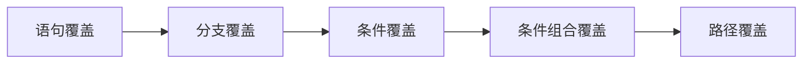
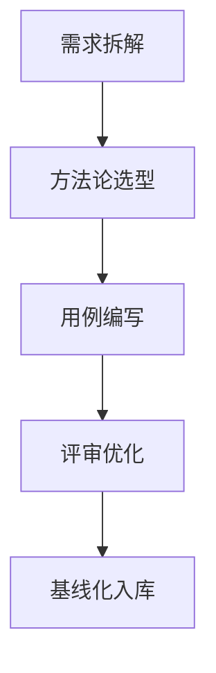
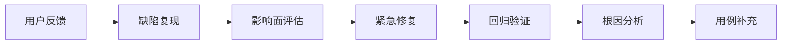
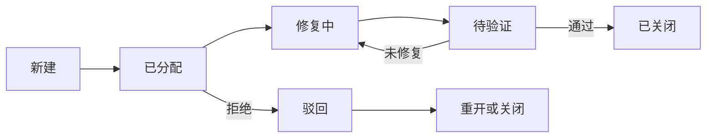

## AI

### **1. 软件生命周期阶段 & 常见模型**  

**答案：**  

- **生命周期阶段**：  
  1. **需求分析**（用户需求→技术规格）  
  2. **设计**（架构设计、模块拆分、接口定义）  
  3. **开发**（编码、单元测试）  
  4. **测试**（集成测试、系统测试、验收测试）  
  5. **部署**（发布、环境配置）  
  6. **运维**（监控、故障修复）  
  7. **废弃**（系统下线）  

- **常见模型**：  
  - **瀑布模型**：线性推进，阶段严格隔离。**风险**：需求变更成本高。  
  - **敏捷模型**（Scrum/Kanban）：迭代开发，快速响应变化。**核心**：用户故事、站会、回顾会议。  
  - **V模型**：测试阶段与开发阶段并行设计。**优势**：测试左移，需求可追溯。  
  - **DevOps模型**：CI/CD流水线，自动化部署。**关键工具**：Jenkins, GitLab CI。  

**面试考察点**：模型适用场景（如瀑布适合需求固定项目，敏捷适合快速迭代）、风险控制能力。  
**推荐阅读**：Martin Fowler《持续交付》、Scrum指南（scrumguides.org）。

---

### **2. 版本控制 & 常用系统**  

**答案：**  

- **版本控制**：跟踪代码变更历史，支持协作、回滚、分支管理。  
- **常用系统**：  
  - **Git**（分布式）：行业标准，支持离线操作。**核心命令**：`git rebase`（整理提交历史）、`git cherry-pick`（选择性合并）。  
  - **SVN**（集中式）：目录级权限控制，适合严格流程企业。  
  - **Mercurial**：类似Git，更简洁的命令设计。  

**高阶考点**：  

- **Git分支策略**（如Git Flow vs. GitHub Flow）  
- **冲突解决原则**（优先沟通后修改，避免强制覆盖）  
**工具对比**：Git适合高频提交，SVN适合大文件存储。  

---

### **3. 软件测试与开发的关系**  

**答案：**  

- **共生关系**：  
  - **测试驱动开发（TDD）**：先写测试用例，再开发功能（需求澄清+质量内建）。  
  - **持续反馈**：测试在迭代中提供质量雷达（如缺陷分布、自动化覆盖率）。  
- **角色演进**：  
  - 传统：测试作为“质量守门员”（阶段末拦截缺陷）。  
  - 现代：测试工程师嵌入敏捷团队，参与需求评审（提前识别歧义）。  

**关键价值**：**测试左移**（提前介入设计） + **测试右移**（监控生产环境）。  

---

### **4. 线上版本测试与更新策略**  

**答案：**  
**测试策略**：  

1. **预发布环境验证**：完全模拟生产环境数据（脱敏后）。  
2. **金丝雀发布（Canary）**：  
   - 流量逐步切分（1%→5%→100%）。  
   - 监控核心指标（错误率、延迟、CPU负载）。  
3. **A/B测试**：新旧版本并行，对比业务指标（如转化率）。  

**容灾设计**：  

- **回滚触发条件**（如错误率>0.5%持续5分钟）。  
- **数据兼容性**：数据库Schema变更需支持双向迁移（如Liquibase工具）。  

---

### **5. 初进公司熟悉项目的方法**  

**答案：**  
**四步法**：  

1. **文档溯源**：  
   - 架构图（微服务/单体）、部署拓扑。  
   - 需求文档（用户故事/JIRA看板）。  
2. **环境实操**：  
   - 本地搭建Dev环境（Docker Compose简化依赖）。  
   - 执行冒烟测试用例（快速验证主干流程）。  
3. **代码窥探**：  
   - 核心模块代码（高复杂度或高频变更文件）。  
   - 自动化测试框架（如Pytest+Allure报告）。  
4. **沟通切入**：  
   - 向开发询问历史缺陷高发模块；  
   - 向运维了解生产环境监控大盘（Prometheus/Grafana）。  

**高效技巧**：优先修复一个简单Bug（熟悉全流程）。  

---

### **6. 软件测试的定义与目的**  

**答案：**  

- **定义**：  
  **系统性验证软件是否满足需求**（功能性、非功能性），通过设计、执行用例来发现缺陷。  
- **目的**：  
  1. **风险控制**：预防线上故障导致的业务损失（如资损、舆情）。  
  2. **质量度量**：提供可量化的质量评估（如千行代码缺陷率）。  
  3. **需求验证**：确保实现与用户期望一致（验收标准达成）。  

**认知升级**：测试不仅是找Bug，更是**质量信息提供者**（通过数据驱动决策）。  

以下针对**测试模型、测试计划、测试类型**三大模块的高阶面试答案，融合技术深度与工程实践：

---

### **2. 测试模型**  

#### 1. 常见测试模型  

**答案：**  

- **V模型**：测试与开发阶段严格对应，强调测试左移（需求阶段设计验收测试）  
- **W模型**：双V结构，测试活动贯穿需求→设计→开发→交付全流程  
- **H模型**：独立测试流程，支持迭代与并行测试（如敏捷中的持续测试）  
- **X模型**：探索性测试驱动，针对未知场景的灵活测试  

**高阶考点**：模型适用场景（V模型适合军工/航天等强流程行业，H模型适合互联网快迭代）  

#### 2. V模型各阶段任务与文档  

| **开发阶段**       | **测试任务**                  | **产出文档**                |  
|--------------------|-----------------------------|---------------------------|  
| **需求定义**       | 评审需求可测性，设计验收测试用例 | 《验收测试计划》          |  
| **设计阶段**       | 制定系统测试方案，设计接口测试  | 《系统测试用例》《接口测试规范》|  
| **编码阶段**       | 编写单元测试，参与代码评审     | 《单元测试报告》《代码评审记录》|  
| **系统集成阶段**   | 执行端到端测试，验证跨模块交互  | 《集成测试报告》《缺陷跟踪表》|  

**核心思想**：**测试设计前置**（需求阶段即开始测试设计）  

---

### **3. 测试计划**  

#### 1. 测试计划目的  

**答案**：  

- **战略对齐**：定义测试范围/资源/风险，确保与项目目标一致  
- **风险管控**：识别测试依赖项（如环境、数据）并制定应对方案  
- **效率基线**：明确准入/准出标准（如自动化覆盖率≥80%）  

#### 2. 测试方案 vs 测试计划  

| **维度**         | **测试计划**                  | **测试方案**                |  
|------------------|-----------------------------|---------------------------|  
| **层级**         | 战略层（What/Why）           | 战术层（How）               |  
| **内容**         | 范围、资源、进度、风险        | 测试技术、环境配置、数据策略 |  
| **类比**         | 建筑工程蓝图                 | 施工技术方案                |  

#### 3. 测试计划六要素  

1. **范围**（测什么/不测什么）  
2. **策略**（测试类型/轮次/工具选型）  
3. **资源**（人力/环境/设备）  
4. **进度**（里程碑对齐开发周期）  
5. **风险**（依赖项应对预案）  
6. **交付物**（报告/缺陷库/自动化脚本）  

#### 4. 测试进度把控  

**实战方法**：  

- **每日燃尽图**：跟踪剩余用例数 vs 计划完成量  
- **阻塞问题看板**：实时公示阻塞开发的缺陷（用红黄绿标识风险）  
- **自动化巡检**：每日定时执行核心链路脚本，统计通过率  
- **风险同步会**：每日站会通报进度偏差（如「环境问题导致3天延迟」）  

#### 5. 做好测试计划的关键  

**四原则**：  

- **精准范围**：用功能矩阵图标注核心/边缘模块（Pareto法则：20%核心模块覆盖80%流量）  
- **弹性策略**：预留20%时间应对需求变更  
- **数据驱动**：基于历史缺陷分布（如支付模块缺陷密度高）分配测试权重  
- **明确标准**：准出条件数字化（如「P0用例100%通过，P1缺陷修复率≥95%」）  

#### 6. 任务跟踪与漏测分析  

**任务跟踪**：  

- **工具**：JIRA看板（To Do/In Progress/Blocked/Done）  
- **规则**：单任务不超过2天，阻塞超4小时升级处理  

**漏测分析**：  

```mermaid
graph TD
A[线上故障] --> B(根因归类：需求误解/用例缺失/环境差异)  
B --> C[更新测试用例库]  
B --> D[补充异常场景测试]  
B --> E[优化监控指标]  # 如未覆盖的日志告警
```

#### 7. 测试人员在开发流程中的任务  

**全周期参与**：  

- **需求阶段**：质疑需求可测性（如「用户模糊搜索」需明确匹配规则）  
- **设计阶段**：参与接口契约设计（避免接口返回结构不可测）  
- **开发阶段**：提供可测试性建议（如增加日志埋点）  
- **发布阶段**：签署质量报告（基于准出标准）  
- **运维阶段**：分析生产缺陷，反哺测试用例  

---

### **4. 测试类型**  

#### 1. 测试种类举例（10+类型）  

- **功能测试**：验证业务逻辑正确性  
- **性能测试**：压力/负载/稳定性测试（如JMeter模拟万级并发）  
- **安全测试**：SQL注入/XSS/CSRF扫描（工具：OWASP ZAP）  
- **兼容性测试**：浏览器/OS/设备矩阵（云测平台：Sauce Labs）  
- **探索性测试**：基于用户旅程的创造性测试  
- **回归测试**：自动化脚本保障基线功能  
- **无障碍测试**：WCAG标准合规性（如屏幕阅读器兼容）  
- **混沌工程**：主动注入故障（网络延迟/服务宕机）验证容错  

#### 2. 六大测试类型关系  

| **类型**       | **测试对象**      | **执行者**    | **目标**                  |  
|---------------|-----------------|-------------|--------------------------|  
| **单元测试**   | 函数/类          | 开发         | 逻辑正确性                |  
| **集成测试**   | 模块间接口        | 测试/开发     | 数据流与交互              |  
| **系统测试**   | 完整系统          | 测试         | 端到端业务流程            |  
| **验收测试**   | 用户需求实现      | 用户/PO      | 业务价值达成              |  
| **黑盒测试**   | 输入输出          | 测试         | 不关注内部结构            |  
| **白盒测试**   | 代码路径          | 开发         | 分支/条件覆盖             |  

**关联**：  

- 单元测试≈白盒测试，系统测试≈黑盒测试  
- 集成测试是灰盒测试（部分知晓内部状态）  

#### 3. 黑盒 vs 白盒测试方法  

| **类型**     | **常用方法**                              |  
|-------------|-----------------------------------------|  
| **黑盒**     | 等价类划分、边界值分析、决策表、状态迁移     |  
| **白盒**     | 语句覆盖、分支覆盖、条件覆盖、路径覆盖        |  

#### 4. 优缺点对比  

|          | **黑盒测试**                          | **白盒测试**                        |  
|----------|-------------------------------------|-----------------------------------|  
| **优点** | 贴近用户视角，无需代码知识              | 覆盖深层逻辑缺陷，优化代码结构        |  
| **缺点** | 路径覆盖不全，盲区多                   | 成本高，需开发技能，业务关联弱        |  

#### 5. 无文档的黑盒测试  

**应对策略**：  

- **逆向工程**：通过界面操作反推业务规则  
- **竞品分析**：参考同类产品设计测试场景  
- **探索性测试**：遍历功能路径记录输入输出组合  
- **用户访谈**：收集高频使用场景作为测试重点  

#### 6. 集成测试 vs 系统测试  

- **集成测试**：验证模块间协作（如订单服务调用库存服务）  
- **系统测试**：验证整体业务闭环（用户下单→支付→发货）  
**关系**：集成测试是系统测试的前提，后者覆盖更广链路  

#### 7. 单元测试策略  

**策略**：  

- **自顶向下**：Mock下层服务，逐步替换为真实实现  
- **自底向上**：先测基础模块，再组合上层  
- **核心模块优先**：针对复杂/高频变更模块重点测试  

**内容**：  

- 参数边界校验  
- 异常分支处理（如空指针、超时）  
- 多线程并发安全  

#### 8. 白盒覆盖标准  

**标准排序**（覆盖率由低到高）：  



**路径覆盖最全面**，但成本极高（循环N次→路径爆炸）  

#### 9. Alpha vs Beta测试  

| **Alpha测试**            | **Beta测试**              |  
|-------------------------|--------------------------|  
| 公司内部模拟环境          | 真实用户生产环境           |  
| 测试人员主导              | 用户自愿参与              |  
| 发现技术层缺陷            | 收集用户体验与兼容性问题    |  

#### 10. 文档测试  

**定义**：验证用户手册、API文档等与产品实际行为的一致性  
**测试点**：  

- 步骤可执行性（按文档操作能否达成目标）  
- 截图与版本匹配  
- 术语准确性（如「单击」≠「双击」）  

#### 11. 其他需关注的文档  

- 架构设计文档（验证部署拓扑描述）  
- 接口契约文档（Swagger定义的字段类型）  
- 故障应急预案（回滚步骤是否可执行）  

#### 12. 紧急插入需求处理  

**五步应对法**：  

1. **影响评估**：新旧功能耦合点分析  
2. **风险协商**：与产品/开发确定测试范围缩减方案（如仅测核心路径）  
3. **精准测试**：  
   - 新增功能：边界值+主干流程  
   - 关联模块：自动化回归核心用例  
4. **线上监控**：发布后实时跟踪错误日志（如ELK配置告警）  
5. **事后复盘**：补充缺失用例至回归库  

#### 13. 安全性测试维度  

| **维度**         | **测试方法**                              | **工具示例**       |  
|------------------|-----------------------------------------|------------------|  
| **身份认证**      | 暴力破解、会话超时、多端互踢               | Burp Suite       |  
| **授权校验**      | 越权访问（水平/垂直）                     | OWASP ZAP        |  
| **数据安全**      | SQL注入、XSS、敏感信息加密（如AES）        | sqlmap           |  
| **传输安全**      | HTTPS/TLS配置审计、中间人攻击              | Wireshark        |  
| **审计追踪**      | 日志脱敏、操作留痕不可篡改                 | ELK日志分析       |  

以下是以**高级软件测试工程师**视角深度解析测试流程、用例设计、缺陷管理及典型实例的面试题库答案，涵盖技术深度与工程实践：

---

### **5. 测试流程**  

#### 1. 软件测试基本流程  

**标准流程**（ISTQB模型）：  


**高阶实践**：  

- **敏捷迭代流程**：  

  1. 需求拆解（用户故事→验收标准）  
  2. 测试左移（参与需求评审）  
  3. 持续测试（自动化流水线每日构建）  
  4. 测试右移（生产环境监控）

#### 2. 测试结束标准  

**三维度标准**：  

1. **质量指标**：  
   - P0/P1缺陷修复率≥98%  
   - 自动化回归通过率100%  
2. **覆盖指标**：  
   - 需求追溯矩阵（RTM）覆盖率≥95%  
   - 代码覆盖率（行/分支）≥80%  
3. **风险指标**：  
   - 已知遗留缺陷有业务方签字豁免  
   - 性能/安全指标达标（如TPS≥1000）  

#### 3. 软件测试七大原则  

1. **缺陷群聚性**：80%缺陷集中在20%模块（聚焦核心）  
2. **杀虫剂悖论**：定期更新用例避免“免疫”  
3. **穷尽测试不可能**：风险驱动测试范围  
4. **早期介入**：需求阶段参与（左移）  
5. **缺陷必然性**：零缺陷是理想状态  
6. **上下文差异**：测试策略因项目而异  
7. **无错谬论**：无缺陷≠用户满意  

---

### **6. 用例设计**  

#### 1. 测试用例定义与要素  

- **定义**：可执行的最小测试单元，包含输入、动作、预期结果  
- **要素**：  

  1. ID（唯一标识）
  2. 模块
  3. 前置条件  
  4. 步骤
  5. 测试数据
  6. 预期结果
  7. 优先级
  8. 实际结果（执行时填写）

#### 2. 用例设计完整过程  



**关键动作**：  

- **需求拆解**：用思维导图分解功能点  
- **方法论选型**：  
  - 功能路径 → 等价类划分  
  - 状态流转 → 状态迁移图  
  - 组合逻辑 → 正交试验法  

#### 3. 优秀测试用例特点  

- **原子性**：单用例验证单一功能点  
- **可执行性**：步骤清晰无歧义（如“点击【提交】按钮”）  
- **可维护性**：参数化设计（数据与逻辑分离）  
- **可追溯性**：关联需求ID  

#### 4. 用例编写注意事项  

- **避免绝对路径**：用相对路径或配置变量  
- **数据独立性**：用例间无状态依赖  
- **防冗余**：合并相似场景（如浏览器兼容性用标签标记）  

#### 5. 有限资源下提效策略  

**三驾马车**：  

1. **精准测试**：  
   - 代码变更分析（仅测影响范围）  
   - 风险模块加权（历史缺陷密度）  
2. **自动化分层**：  
   - API自动化覆盖核心链路  
   - UI自动化只做关键路径  
3. **众包测试**：非核心功能外包（如兼容性测试）  

#### 6. 降低漏测率  

- **缺陷分析**：每月分析漏测缺陷，归类原因（用例缺失/数据不足）  
- **探索性测试**：定期Session-Based测试  
- **生产监控**：将线上错误日志转化为测试用例  

#### 7. 测试用例设计方法  

| **方法**         | **适用场景**          | **示例**                |  
|------------------|---------------------|------------------------|  
| 等价类划分        | 输入域验证            | 用户名长度6-20字符       |  
| 边界值分析        | 数值边界              | 长度5/6/20/21字符        |  
| 决策表            | 多条件组合逻辑        | 折扣规则（会员+商品类型） |  
| 状态迁移          | 状态驱动功能          | 订单状态流转             |  
| 错误推测法        | 经验驱动异常场景      | 断网提交表单             |  

#### 8. 为什么写测试用例  

- **知识传承**：避免人员离职导致业务知识丢失  
- **效率工具**：减少重复测试成本  
- **质量基线**：量化测试覆盖度  

#### 9. 线上问题处理流程  



**关键动作**：  

- **影响面评估**：日志分析影响用户比例  
- **根因分析**：5Why法追溯至流程漏洞  

#### 10. 测试用例的地位与作用  

- **地位**：测试执行的“宪法”  
- **作用**：  
  - 质量标尺（通过率反映质量）  
  - 沟通媒介（开发修复依据）  
  - 审计依据（合规要求）  

---

### **7. 缺陷BUG**  

#### 1. 缺陷报告定义与要点  

- **定义**：记录缺陷现象、路径、影响的技术文档  
- **作用**：开发修复依据 + 质量分析数据源  
- **要点**：  
  - 可复现（明确步骤）  
  - 完整（环境/数据/日志）  
  - 原子性（一缺陷一报告）  

#### 2. 缺陷报告5C原则  

| **原则**  | **说明**                     |  
|----------|----------------------------|  
| Correct  | 准确描述现象（非主观推测）     |  
| Clear    | 语言简洁无歧义               |  
| Concise  | 聚焦核心问题（避免冗余）      |  
| Complete | 包含环境/数据/日志           |  
| Consistent| 格式统一（如JIRA模板）        |  

#### 3. 缺陷生命周期  



**关键状态**：  

- **驳回**：需测试经理与开发仲裁  
- **延期**：标注原因及计划版本  

#### 4. 缺陷报告内容  

**十要素**：  

1. 标题  2. 复现步骤  3. 实际结果  
4. 预期结果  5. 环境  6. 严重等级  
7. 优先级  8. 附件  9. 关联用例ID  
10. 提交人/日期  

#### 5. 提高缺陷记录质量  

- **模板化**：JIRA自定义字段强制填写  
- **截图规范**：箭头标注问题区域  
- **日志摘要**：提取关键错误栈（非全量）  

#### 6. 开发拒绝缺陷处理  

**四步法**：  

1. 复现确认（当面演示）  
2. 需求追溯（出示文档条款）  
3. 仲裁升级（PO/技术负责人）  
4. 流程改进（复盘需求模糊点）  

#### 7. 低重现率Bug处理  

- **信息收集**：  
  - 系统日志（复现时Debug模式）  
  - 环境变量（内存/CPU）  
- **监控增强**：  
  - 代码埋点（记录函数入参）  
  - 自动化随机触发（Monkey测试）  

#### 8. 缺陷优先级划分  

| **级别** | **响应时效** | **标准**               |  
|----------|------------|----------------------|  
| P0       | 2小时内      | 主干功能完全阻塞        |  
| P1       | 24小时内     | 核心功能异常          |  
| P2       | 下一版本     | 边缘功能问题          |  
| P3       | 可选修复     | 体验优化建议          |  

#### 9. 开发未提测上线出问题  

**应对步骤**：  

1. **责任澄清**：出示未提测证据（邮件/聊天记录）  
2. **紧急止损**：协助定位+回滚方案  
3. **流程加固**：推动建立提测门禁（Jenkins流水线检查）  

#### 10. 常用辅助工具  

| **类型**       | **工具**                    |  
|----------------|----------------------------|  
| 缺陷管理        | JIRA/禅道                  |  
| 自动化测试      | Selenium/Appium/Pytest     |  
| 性能测试        | JMeter/Locust              |  
| 安全扫描        | OWASP ZAP/Burp Suite      |  
| 日志分析        | ELK Stack                  |  
| 环境管理        | Docker/K8s                 |  

---

### **8. 测试实例**  

#### 1. 带广告纸杯测试用例  

**测试维度**：  

- **功能**：盛热水时广告是否脱落  
- **安全**：印刷颜料毒性检测  
- **用户体验**：图案是否易被遮挡  

#### 2. 身份证输入框用例设计  

**关键用例**：  

- 18位数字+校验位（末位X）  
- 首位不为0  
- 粘贴含空格自动过滤  
- 未成年用户提示（根据出生年月）  

#### 3. 登录功能测试用例  

| **分类**       | **用例示例**                  |  
|----------------|----------------------------|  
| 正常流          | 正确账号密码跳转首页          |  
| 异常流          | 错误密码提示明确              |  
| 安全            | 连续失败5次锁定               |  
| 性能            | 万级并发响应<2s               |  

#### 4. 移动端 vs Web端测试区别  

| **维度**       | **移动端**                  | **Web端**               |  
|----------------|----------------------------|------------------------|  
| 设备碎片化      | 覆盖不同OS/分辨率            | 主流浏览器              |  
| 网络场景        | 弱网/断网重连                | 弱网模拟少              |  
| 交互方式        | 手势操作（滑动/长按）         | 鼠标悬停               |  

#### 5. C/S客户端测试因素  

- 安装卸载（管理员权限）  
- 增量更新策略  
- 本地数据库加密  
- 多端数据同步  

#### 6. 电梯测试用例（经典7维度）  

1. **功能**：超载报警  
2. **性能**：满载上升速度  
3. **安全**：断电应急电源  
4. **兼容**：不同身高操作  
5. **体验**：开关门噪音  
6. **异常**：故障紧急呼叫  
7. **稳定**：连续运行72小时  

#### 7. 圆珠笔测试用例  

- 书写功能：连续1000米不断墨  
- 结构安全：笔尖缩回后抗跌落  
- 环境兼容：高海拔不漏墨  

#### 8. 网购购物车测试  

- **商品管理**：添加100件商品  
- **价格计算**：跨店满减+优惠券  
- **状态同步**：多端实时删除  

#### 9. 微信点赞功能测试  

- 点赞后显示头像（时序）  
- 取消点赞头像消失  
- 万赞列表滑动性能  

#### 10. 搜索框测试设计  

- **输入校验**：SQL注入防御  
- **结果相关度**：模糊搜索提示  
- **性能**：实时搜索防抖  
- **体验**：无结果推荐关键词  

## AI2

1. 什么是软件测试？目的是什么？
参考答案： 验证软件是否符合需求、发现缺陷、评估质量，确保软件可用性、可靠性和性能。核心目的是降低风险。

1. 软件测试的生命周期（STLC）包含哪些阶段？
参考答案：
需求分析 → 测试计划 → 测试设计 → 测试环境搭建 → 测试执行 → 缺陷管理 → 测试报告 → 测试结束。

1. 黑盒测试 vs 白盒测试的区别？
参考答案：

  • 黑盒：只关注输入输出，不关心内部逻辑（基于需求文档）。

  • 白盒：基于代码结构设计用例，需了解程序内部实现。

4. 静态测试 vs 动态测试？举例说明
参考答案：

  • 静态测试：不执行代码，如文档评审、代码走查。

  • 动态测试：执行程序并观察行为，如功能测试、性能测试。

5. 什么是回归测试（Regression Testing）？何时执行？
参考答案： 验证修复缺陷或新增功能后，原有功能未被破坏。通常在代码变更后或版本发布前执行。

二、 测试类型与方法

6. 解释以下测试类型：

  • 冒烟测试（Smoke Testing）：验证核心功能是否可用，决定是否继续深入测试。

  • 探索性测试（Exploratory Testing）：同步设计、执行和学习的测试方法，依赖测试者经验。

  • 猴子测试（Monkey Testing）：随机输入数据，检查系统是否会崩溃。

7. 单元测试、集成测试、系统测试、验收测试的区别？
参考答案：

测试级别 测试对象 执行者
单元测试 单个函数/模块 开发人员
集成测试 模块间接口 开发/测试
系统测试 完整系统 测试工程师
验收测试 用户需求验证 客户/产品经理

8. 什么是兼容性测试？需覆盖哪些维度？
参考答案： 验证软件在不同环境下的行为。维度包括：浏览器、操作系统、设备（移动端）、分辨率、网络环境等。

9. 性能测试有哪些类型？
参考答案：

  • 负载测试（模拟用户压力）

  • 压力测试（超出极限的负载）

  • 并发测试（多用户同时操作）

  • 稳定性测试（长时间运行）

三、 测试用例设计

10. 解释以下测试用例设计方法：

  • 等价类划分：将输入数据划分为有效/无效类（如：用户名长度为6-18字符）。

  • 边界值分析：测试边界值（如：6和18字符，以及5、19字符）。

  • 因果图/判定表：处理多个输入条件的组合逻辑（如：登录页的“记住密码”+“自动登录”组合）。

  • 状态转换图：测试系统在不同状态下的行为（如：订单状态：待支付→已支付→发货中）。

  • 错误推测法：基于经验猜测可能出错的地方（如：空表单提交、重复操作）。

11. 测试用例应包含哪些必要元素？
参考答案： 用例ID、模块名称、前置条件、测试步骤、输入数据、预期结果、实际结果、优先级等。

四、 Bug管理流程

12. Bug的生命周期包括哪些状态？
参考答案：
新建 → 分配 → 修复 → 验证 → 关闭（可能包含“拒绝”“延迟”“重开”状态）。

13. 一个合格的Bug报告应包含哪些信息？
参考答案：

  • 标题（简洁描述问题）

  • 重现步骤

  • 实际结果 vs 预期结果

  • 环境信息（浏览器/OS/版本）

  • 截图/日志/视频

  • 严重程度（如：致命、严重、一般、建议）

14. Bug严重程度（Severity） vs 优先级（Priority）的区别？
参考答案：

  • 严重程度：缺陷对系统功能的影响程度（技术视角）。

  • 优先级：修复该缺陷的紧急程度（业务视角）。

五、 数据库与接口测试基础

15. SQL常用操作有哪些？（必考！）
参考答案：

SELECT * FROM users WHERE age > 20;  
UPDATE orders SET status = 'shipped' WHERE id = 100;  
DELETE FROM cart WHERE user_id = 5;  
INSERT INTO products (name, price) VALUES ('Mouse', 99.9);

1. GET请求 vs POST请求的区别？
参考答案：

GET POST
数据位置 URL参数（可见） 请求体（不可见）
安全性 不安全（数据暴露在URL） 相对安全
数据长度 有限制（取决于浏览器） 无限制
缓存 可缓存 不可缓存

18. 什么是API测试？常用工具？
参考答案： 验证API的功能、性能、安全性。常用工具：Postman、JMeter、Swagger、curl。

六、 测试工具与自动化

19. 你知道哪些测试管理工具？缺陷管理工具？
参考答案：

  • 测试管理：TestLink、Xray、Zephyr

  • 缺陷管理：Jira、Bugzilla、禅道

20. 自动化测试框架有哪些？
参考答案：

  • Web UI自动化：Selenium、Cypress、Playwright

  • 移动端：Appium、Espresso (Android)

  • API自动化：RestAssured、Requests (Python)

  • 性能测试：JMeter、LoadRunner

21. 什么情况下适合做自动化测试？
参考答案：

  • 重复性高（如冒烟测试）

  • 需求稳定

  • 需高频回归的模块

  • 多环境兼容性验证

七、 Linux & 网络基础（加分项）

22. 常用的Linux命令有哪些？
参考答案：

ls -l      # 查看文件详情
grep "error" log.txt  # 搜索文本
chmod 755 script.sh   # 修改权限
tail -f app.log       # 实时查看日志
ps -aux | grep java   # 查看进程

23. 如何用Linux命令查看端口占用？
参考答案：

netstat -tuln | grep 8080

# 或

lsof -i :8080

八、 情景与开放性问题

24. 如果你发现一个Bug但开发认为不是问题，如何处理？
参考答案：

  • 复现Bug并提供完整证据链（步骤、日志、截图）。

  • 对照需求文档说明预期结果。

  • 邀请第三方（产品经理）参与确认。

25. 如何测试一个“登录”页面？
参考答案：

  • 功能：有效/无效账号、密码隐藏、验证码逻辑、忘记密码跳转。

  • 安全：SQL注入、XSS攻击、账号锁定机制。

  • 兼容性：不同浏览器/设备显示正常。

  • 用户体验：错误提示清晰、加载速度。

26. 软件测试工程师的核心能力是什么？
参考答案：
需求分析能力 + 严谨的逻辑思维 + 沟通协作能力 + 持续学习意愿。
